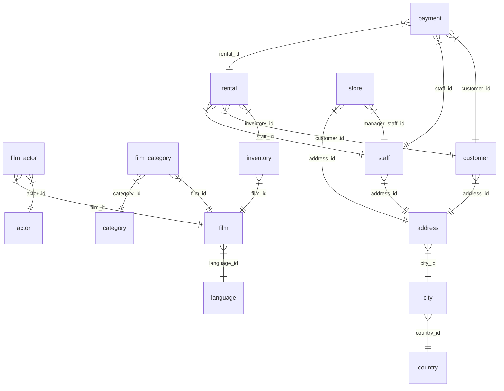

<!-- @generated
This file is automatically generated by Kanel. Do not modify manually.
-->
# DVD Rental Database

A PostgreSQL database modelling a DVD rental store. It tracks the film catalog, physical inventory across stores, customers, staff, and rental transactions.

## Entity Relationship Diagram

## Tables

| Table | Description |
| ----- | ----------- |
| [language](tables/language.md) |  |
| [film_actor](tables/film_actor.md) |  |
| [actor](tables/actor.md) |  |
| [film_category](tables/film_category.md) |  |
| [inventory](tables/inventory.md) |  |
| [address](tables/address.md) |  |
| [rental](tables/rental.md) |  |
| [country](tables/country.md) |  |
| [staff](tables/staff.md) |  |
| [customer](tables/customer.md) |  |
| [store](tables/store.md) |  |
| [category](tables/category.md) |  |
| [payment](tables/payment.md) |  |
| [film](tables/film.md) |  |
| [city](tables/city.md) |  |

## Views

| View | Description |
| ---- | ----------- |
| [staff_list](views.md#staff_list) |  |
| [actor_info](views.md#actor_info) |  |
| [film_list](views.md#film_list) |  |
| [sales_by_film_category](views.md#sales_by_film_category) |  |
| [sales_by_store](views.md#sales_by_store) |  |
| [customer_list](views.md#customer_list) |  |
| [nicer_but_slower_film_list](views.md#nicer_but_slower_film_list) |  |

## Enums

### mpaa_rating

Values: `G`, `PG`, `PG-13`, `R`, `NC-17`

## Functions & Procedures

See [functions.md](functions.md) for full signatures and definitions.

| Name | Returns | Description |
| ---- | ------- | ----------- |
| inventory_in_stock | boolean |  |
| inventory_held_by_customer | integer |  |
| last_updated | trigger |  |
| film_not_in_stock | integer |  |
| _group_concat | text |  |
| new_func | table |  |
| last_day | date |  |
| get_customer_balance | numeric |  |
| rewards_report | customer |  |
| film_in_stock | integer |  |
